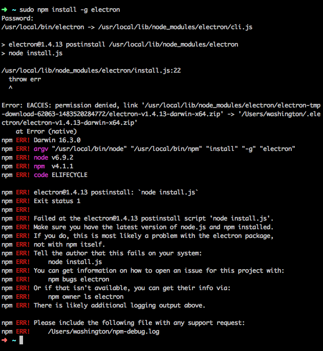
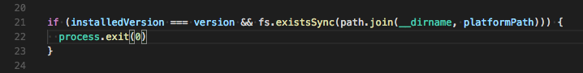
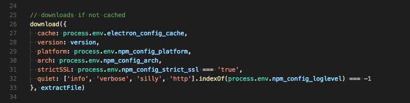

## Electron

JS 越来越浪了，区区浏览器已经管不了这孩子了，一个没看住，就已经浪到原生客户端的地盘上去了，一边是开着 React Native 去找 iOS 和 Android 搞事情，一边又开着 Electron 想去单挑 WPF 和 Mac，甚至还准备响应“一带一路”帮帮好基友 Linux。

不过浪太大，总有翻船的时候，Electron 上的坑还是比较多的，比如安装……是的，从安装开始就是坑。今天说的这个坑其实很早就遇到，不过当时一心等官方给方案，等了好久都没有结果，于是被迫自己动手。这片博文，一方面记录一下方案的细节，估摸着以后版本更新时候还会用到，到时能再翻出来看看，另一方面也给大家分享一下，虽然 Github 上挂着相关的 Issue，不过我知道大部分国内开发者其实是不会主动去看的。

## Electron 的安装

Electron 通过 npm 进行安装，和其他 npm 上的包没什么两样：
```bash
npm i -D electron
// 或者
yarn add electron
```

理论上只要这样两行命令，剩下的都是自动的，不过就是在这里，问题来了。

## 入坑

大部分开发者都会遇到这样一个问题：安装 Electron，npm 命令结束，开始执行本地安装脚本，到执行 `node install.js` 这一步时候卡住不动，或是直接报错退出。



从报错信息上看，似乎是在本地文件操作上遇到了权限问题。

该问题在 Github 上有对应的 Issue：<a target="_blank" href="https://github.com/electron/electron/issues/8339">Failed at the electron@1.4.13 postinstall script 'node install.js' #8339</a>，目前有手动解决的办法，但官方还没有给出任何的解决办法。（然而居然就这样 Close 了）

一般的也就是卡在这里了，然后说好的学习 Electron 的计划就这么中断了，从入门到放弃，就这么轻松。不过既然是 JS 的问题，那么我们完全可以先去看下源码，说不定就能找到原因了呢。

## 出坑第一步：解决本地依赖

这是我自己探索发现的一个解决办法，对发文当天及之前的版本都是有效的，后续版本如果依然遇到该问题可以参考该方案，原理上应该是一样的，但具体细节上不保证完全一致，毕竟版本更新了。

先执行常规的 npm 安装。

当要执行到 `node install.js` 的时候，赶紧按下 `Ctrl + C` 结束掉进程。别担心，到这里为止我们需要的内容已经都拿到了，剩下的我们手动来解决。（这一步的时机可能需要多试几次才能掐准，有点像 Windows 开机进 BIOS 的感觉，早了必要的文件还没下载完，晚了就错过了。实践发现报错的同时会把已经下载的内容连同 electron 目录一起删掉，按照报错信息会找不到文件，所以时机很重要）

进入你项目根目录下的 `./node_modules/electron` 目录，你就能看到前面报错的那个 `install.js` 文件，找个文本编辑器打开看下，其实没几行代码，就做两件事：下载 Electron 的发行包（一个zip压缩包），然后解压。既然是这里面报的错，那么我就来看看代码，到底怎么回事。

报错信息提示问题在第 22 行： `throw err` ，我们先来看一下。



22 行的作用似乎是检测到已安装的版本后，直接结束进程。不清楚为什么会判断我已经安装过，但是可以肯定的是，为了验证方法的可行性，我特地把之前安装的内容彻底卸载之后重新安装的，所以这个肯定不对，于是乎再来搜一下 `throw err` ，发现在第 46 行定义了一个 `onerror` 函数（每个人的报错信息似乎都有些不太一样，可能和具体版本有关，Github Issue 上有看到直接提示第 46 行的），而该函数只有在第 36 行定义的 `extractFile` 函数中用到，既然如此，那应该就是在第二步解压文件的时候出了问题。


既然如此，我们就手动去解压这个文件。不过在此之前，我们得先去下载发行包。下载发行包的过程也是在 `install.js` 中执行的，由于之前我们手动结束了进程，这个过程也就没跑完。如果你遇到的情况是在 `node install.js` 时卡住，那其实就是在等待下载发行包，等看到报错信息时，发行包实际上就已经下载好了，可以直接拿来用（取决于你使用的版本，可能在 `~/.electron` 或 `./node_modules/electron/.electron` 目录下）。不过下载过程没有进度，不知道什么时候能完，不如自己手动去下。



发行包很好找，直接到 Github 上搜“electron/electron”，到 Release 面板下，下载对应平台的最新版本即可（没有特殊需求的话就下不带后缀的版本就好了）。

下载完成后解压到项目根目录下的 `./node_modules/electron` 目录，重命名为dist。

在项目根目录下的 `./node_modules/electron` 目录中新建一个 `path.txt` 文件，写入内容“dist/Electron.app/Contents/MacOS/Electron”（这里以 macOS 为例，Windows 和 Linux 平台的内容略有差异，具体内容可以从前面的 install.js 文件最末尾看到）

> 2018-10-06：Electron 3.0 对 path 的取值做了些许调整，改成了“Electron.app/Contents/MacOS/Electron”

至此，本地依赖就安装完成了。在项目根目录下执行 `./node_modules/electron/dist/Electron.app/Contents/MacOS/Electron .` 就可以运行 App 了。当然聪明的朋友肯定知道用 `package.json` 里的 `scripts` 字段来简化这段命令。

然后就可以通过 `npm run start` 来启动了。

## 出坑第二步：解决全局命令

安装完本地依赖后，其实就已经可以正常使用了，该有的功能一个不少。但是如果我们希望 `electron` 命令能够全局使用，我们还需要全局安装一下。

方法其实跟本地安装时一样的，只有两点区别：

- npm 执行全局安装 `sudo npm i -g electron`
- 原本在项目根目录下的操作，全部转移到 Node.js 的全局模块所在位置，如果你没有修改过的话，默认是 `/usr/local/lib/node_modules/electron` （这里以 Mac 为例，不同平台具体位置可能会有差异）。

## 另一种思路

其实在探索过程中，我们看到了 Electron 的发行包中提供了 `Electron.app` 文件（在 Windows 下是同名的 exe 文件），通过命令行启动实际运行的也是它，那我们其实完全可以直接运行这个程序。在 Terminal/命令提示符 中配置一个 alias，让 `electron` 命令指向对应的可执行文件即可。

当然这个方案有一个很明显的缺点，就是脱离了 npm 的管理，开发过程中如果需要查看/升级版本相关信息就没那么方便了。

## 更新

更新的方式其实和安装一样，当通过 yarn 或是 npm 发现有可用更新时，直接去官网下载最新啊 release 包，解压后覆盖原有的内容即可，必要时候手动更新一下 package.json 文件里的版本号即可。

## 后记（2018-12-10）

时至今日，Electron 都快发布 4.0 了，这个问题还是如此。从第一次发布这篇文章到现在，我更新过 node 版本，换过网络环境，换过电脑，但始终都会遇到这个问题。所以我很难想象那些成功安装的人是怎么做到的。

比较意外的是，当我某一次尝试 cnpm 的时候，竟然奇迹般的一边安装成功，但使用 yarn 和 npm 时从未成功过（日常一直都是用的淘宝的源，为测试也用过官方的源，但都不行）。