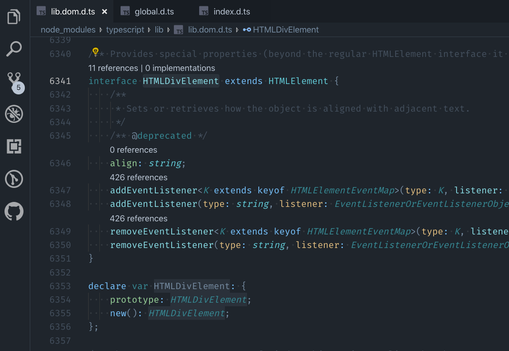
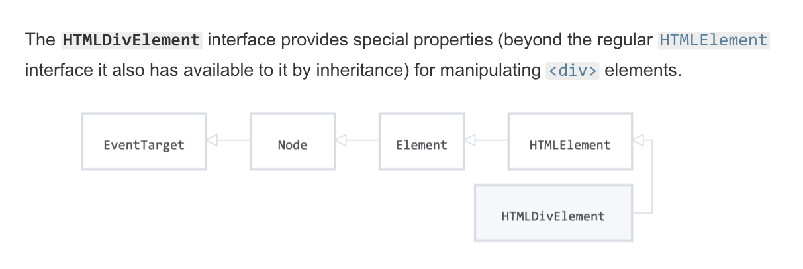
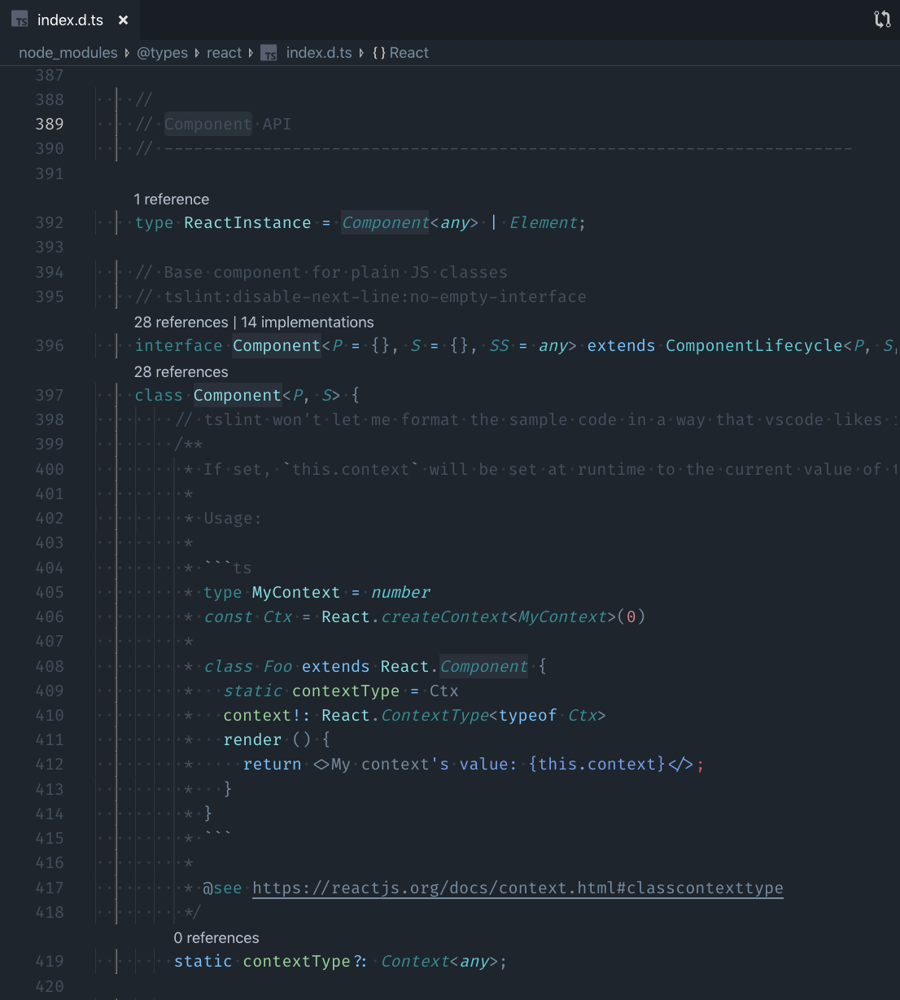
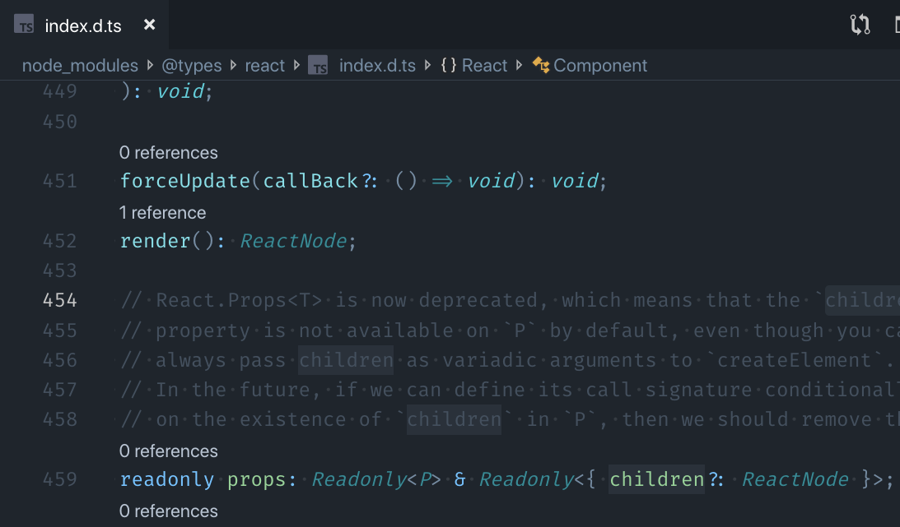
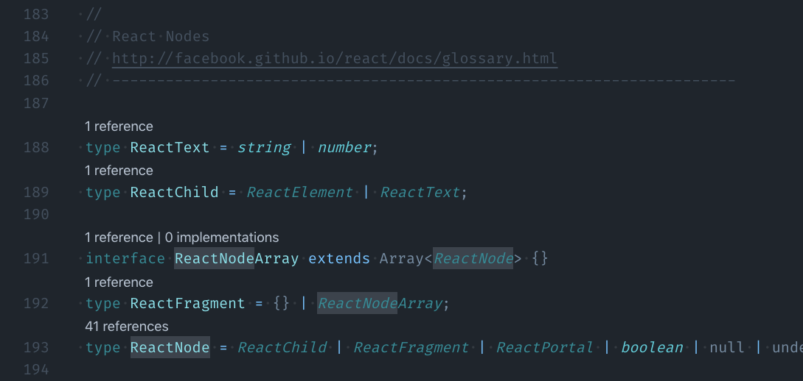
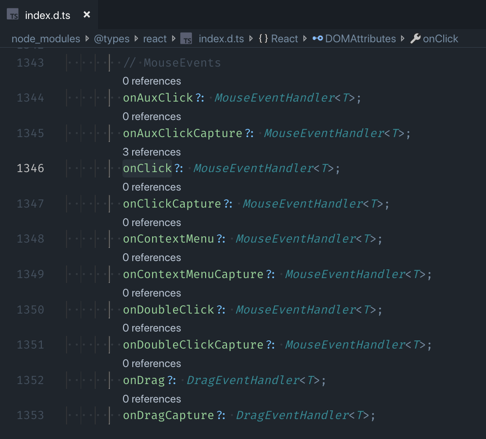
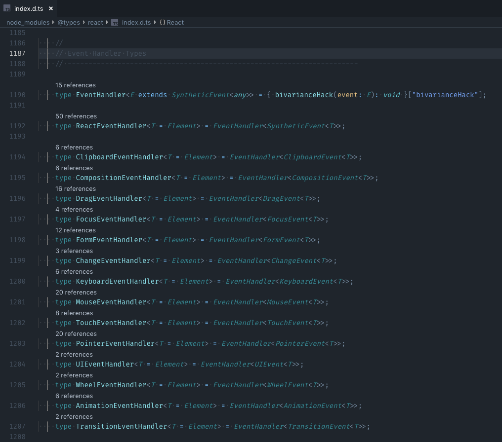
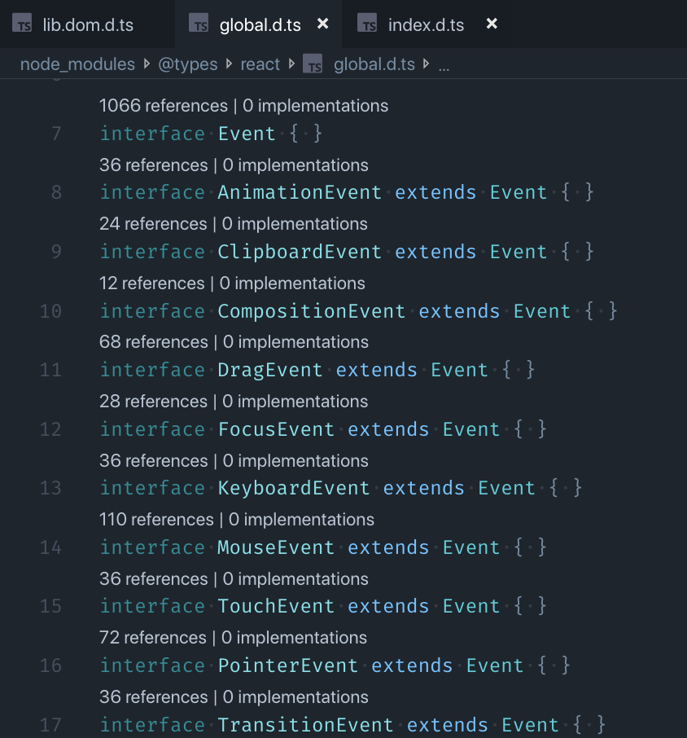

## 杂谈

不知道是就我这样，还是大家也是，最近的内容圈子里关于 TypeScript 的文章满天飞，各种 TypeScript 有多好、多受欢迎，要不就是 TypeScript 的教程、实践。偏偏我在这时候有了写这篇文章的想法，搞得很有跟风蹭热度的嫌疑。

作为一名坚持原创的作者，我并不想把市面上随手可得的东西，换一种方式再讲给大家听，这样不仅是在浪费大家的时间，也是在浪费我自己的时间。我所理解的为社区做贡献，应该是能够填补当前环境下的一些空白，去做一些真正有意义的事，而不是摆出一副资深的样子，去转发或是创造一些重复的内容。

今天这篇文章，虽然有跟风的嫌疑，但我向你保证，内容依然是绝对的原创。如有巧合，那么英雄所见略同。

## 为什么是次日？

上手 TypeScript 并不难，有 JavaScript 基础的同学，花个一天时间过一遍文档，基本就都清楚了。如果你刚好还有 Java、C# 等后端语言的基础，那么其中关于 OOP 的一些概念相信你一定会觉得非常眼熟。

如果你刚看完文档就开始准备把 TypeScript 用到项目中去，那么恭喜你，你很快就会遇到各种坑，而且你无法直接从文档中寻找到对应的解决方案。这篇文章的存在，就是希望能够填补这中间的空白，帮助各位顺利的把 TypeScript 落地到项目中。

这便是标题中「次日」的由来。如果你还没有看过 TypeScript 的文档，那么这篇文章现在还不适合你，建议先收藏起来，等看完了文档再回来。

如果你已经准备好了，那我们开始吧。

## 你或许并不需要 TypeScript

每个人接触 TypeScript 的原因不同，有的是被人安利，有的是因为团队在用，有的是因为用了 Angular。但不管因为什么入了这个坑，我们都需要明白：TypeScript 并非必须。

TypeScript 适合大型项目，小型项目最好还是继续用 JavaScript。这已经是业内的一个共识。

TypeScript 可以简单理解为 JavaScript + Types。从工程效率的角度上讲，Types 的部分属于额外的工作量，如果不能给项目带来足够的收益，去平衡掉其引入的成本，那么这项投入就不是很值得。

如果只是官网之类的小型项目，类型不类型的并不重要，没必要为了用 TypeScript 而用 TypeScript。但随着项目的规模和复杂度的增加，代码质量、沟通成本等问题开始浮现，而这恰恰是类型系统能够解决的问题。通过类型检测，我们可以更早的发现潜在的类型错误，进行主动防御，进而提高代码质量；通过类型定义，我们可以更加直观的描述我们的数据结构，降低团队作业中的沟通成本。

因此，要不要用 TypeScript，取决于你项目的类型以及规模，不要盲目跟风。

## 别忘了 jsDoc

很多人对 TypeScript 有一个误解，觉得有了静态类型的代码已经足够「自解释」，就不需要 jsDoc 一类的注释了。

静态类型描述的是数据的结构，而注释描述的是数据的作用，两者解决的是不同的问题，彼此之间并不冲突。

比如下面这段 JavaScript 代码：

```js
function convert (val, config) {
  // some code
}
```

不难看出这是一个转换函数，接收一个待转换的值，以及一个配置对象，但我们并不知道这个函数用来转换什么，配置对象又有哪些参数。

现在我们用 TypeScript 来重写一下，补充一些类型定义。

```ts
function convert (val: string, config: { x: string, y? :boolean}): string {
  // some code
}
```

现在我们知道了这是一个用于处理字符串的转换函数，配置对象有两个参数，一个是必选的字符串，一个是可选的布尔值，最后返回的也是一个字符串。但具体到业务中，这个函数用来转换什么样的字符串，我们还是不太清楚。

```ts
/**
 * @description 对手机号进行编码，隐藏其中一部分，如：13812345678 -> 138****5678
 * @param val 待编码的手机号
 * @param config 配置选项
 */
function convert (val: string, config: { x: string, y? :boolean}): string {
  // some code
}
```

加上注释之后，一切就都清楚了：这是一个对手机号进行编码，将其中一部分替换成其他字符，以保护用户隐私的函数。

所以你看，TypeScript 并不能完全替代 jsDoc 的作用，该写的注释还是得写。

当然对于上面的例子，如果是一个单纯的工具函数，我们完全可以使用更加直观的命名，比如 `encodeMobile (mobile, config)`，但如果这是某个类中的成员函数，那么可能就不可避免地会出现示例中的写法。总之，你明白我的意思就好，就不要钻牛角尖了。

对了，得益于 TypeScript 的类型系统，`@param` 不需要再指定数据类型了，只要对变量的用途进行描述就好了。如果你配置了 Lint 工具，它也会提醒你优先使用 TypeScript 来定义类型，不要重复定义。

## TSX 和 JSX

之前我们在用 JavaScript 写 React 时，对文件的扩展名没有什么特别的要求，`*.js` 或者 `*.jsx` 都行。

但在 TypeScript 中，如果你要使用 JSX 语法，就不能使用 `*.ts`，必须使用 `*.tsx`。如果你不知道，或者忘了这么做，那么你会在使用了 JSX 代码的地方收到类型报错，但代码本身怎么看都没有问题。这也是刚上手 TypeScript + React 时几乎每个人都会遇到的坑。

关于这一点，TypeScript 只是在官方教程的示例代码中直接用了 `*.tsx`，但并没有明确说明这一问题。

React 则在它的官方文档中说明了这一规则：

> In React, you most likely write your components in a `.js` file. In TypeScript we have 2 file extensions:
>
> `.ts` is the default file extension while `.tsx` is a special extension used for files which contain JSX.

> 在使用 React 时，我们通常会把组件写在一个 `.*js` 文件里。在 TypeScript 中我们有两种文件扩展名：
>
> `.ts` 是默认的文件扩展名，而 `.tsx` 是用于包含了 JSX 的文件的特殊扩展名。

其实上面这段话也没有明说在 `*.ts` 中使用 JSX 会报错，所以即便有人看到了这段话，可能也以为只是像 `*.jsx` 一样多了一种选择，并没有太当回事……直到遇到问题。

## 变量的 Type 怎么找

上手 TypeScript 之后很快我们就发现，即便是原生的 DOM、或是 React 的 API，也经常会要我们手动指定类型。但这些结构并不是简单的 JavaScript 原始类型，在使用 JavaScript 编写相关代码时候由于没有这种需要，我们也没关心过这些东西的类型，突然问起来，还真不知道这些类型叫什么名字。

不光是这些标准类型，同样的问题在很多第三方的库中也会遇到，比如一些组件库会检查你传入的 Props。

在我看来，这中间其实缺少了一部分的文档，来指导新用户如何找到所需要的类型。既然社区没有提供，那就我来吧。

当然，让每个开发者都熟记所有的类型肯定是不现实的，总不能每接触一个新的库，就要去记一堆类型吧。放心，世界还是美好的，这种事情，当然是有方法的。

最直白的方法就是去看库的 Types Definition，也就是那些 `.*d.ts` 文件。如果你刚好有在用 VS Code 的话，有一个非常方便的操作：把鼠标移动到你想知道它类型的代码上（比如某个变量、某个函数调用，或是某个 JSX 标签、某个组件的 props），右键选择「Go to Definition」（或者光标选中后按 F12），就可以跳转到它的类型定义文件了。

如果你更习惯使用 VS Code 之外的编辑器，我相信时至今日，它们应该也都早就对 TypeScript 提供了支持。具体操作我不太熟悉，你可以自己探索下（我一直用 VS Code，其它的不太熟）。

一般来说，这个操作可以直接把你带到你想要的地方，但考虑到类型是可以继承的，有时候一次跳转可能不太够，遇到这种情况，那就需要你随机应变一下，沿着继承关系多跳几次，直到找到你想要的内容。

对于不熟悉的类型，可以通过这个方法去寻找，慢慢熟悉以后，你会发现，一些常见的类型还是很好找的，稍微联想一下英文的表达方式，配合自动补全的提示，一般都不难找到。

为了方便初学者，我们还是稍微列举一些常见的类型，找找感觉：

### 常见 Types 之 DOM

TypeScript 自带了一些基本的类型定义，包括 ECMAScript 和 DOM 的类型定义，所有你需要的类型都可以从这里找到。如果你想做一些「纯 TypeScript 开发」的话，有这些就够了。

比如下面这张截图，就是对 `<div>` 标签的类型定义。我们可以看到，它继承了更加通用的 `HTMLElement` 类型，并且扩展了一个即将被废弃的 `align` 属性，以及两组 `addEventListener` 和 `removeEventListener`，注意这里使用了重载。



这里的命名也不是随便起的，都是在 [MDN](https://developer.mozilla.org/en-US/docs/Web/API/HTMLDivElement) 上可以查到的。

还是以 `<div>` 为例，我们已经知道它继承自 `HTMLElement`，其实再往上，`HTMLElement` 继承自 `Element`，`Element` 又继承自 `Node`，顺着这条路，你可以挖掘出所有 HTML 标签的类型。



对于一些 DOM 相关的属性，比如 `onclick`、`onchange` 等，你都可以如法炮制，找到它们的定义。

### 常见 Types 之 React

关于 TypeScript 的问题，有不少其实是在使用第三方库的时候遇到的，React 就是其中比较典型的一个。

其实方法都一样，只不过相关的类型定义不在 TypeScript 中，而是在 `@types/react` 中。

React 的类型定义的名称其实也很直观，比如我们常见的 `React.Component`，在定义 Class 组件时，我们需要对 Props 和 State 预先进行类型定义，为什么呢？答案就在它的类型定义中。



再比如，当我们在写一些组件时，我们可能会需要向下传递 `this.props.children`，但 `children` 并没有被设为默认值，需要我们自己定义到 props 上，那么它的类型应该是什么呢？

到类型定义中搜一下关键字 children，很快我们就找到了下面的定义：



所有 React 中 JSX 所代表的内容，无论是 `render()` 的返回，还是 `children`，我们都可以定义为一个 `ReactNode`。那这个 `ReactNode` 长什么样呢？我们通过右键继续寻找：



看到这里，我们不光找到了我们想要的类型，还顺带明白了为什么 `render()` 可以返回 boolean、null、undefined 表示不渲染任何内容。

那么事件呢？当我们给组件定义事件处理函数的时候，也经常会被要求指定类型。还是老办法，找不到咱就搜，比如 `onClick` 不清楚，那我们就以它为关键字去搜：



据此我们找到一个叫 `MouseEventHandler` 的定义，这名字，够直白吧。

好了，我们找到想要的了。不过既然来了，不如继续看一下，看看还能发现什么。我们右键 MouseEventHandler 急需往下看：



看到了吗，所有的事件处理函数都有对应的定义，每个都需要一个泛型参数，传递了事件的类型，名称也挺直白的。



Ok，事件的类型也被我们挖出来了，以后如果需要单独定义一个事件相关的类型，就可以直接用了。

以此类推，不管是什么东西的类型，都可以去它们对应的 `@types/xxx` 里，按关键字搜，只要你的英语别太差，很容易就能找到。

## 多重 extends

我们知道 Interface 是可以多继承的，extends 后面可以跟多个其它 Interface，我们不能保证被继承的多个 Interface 一定没有重复的属性，那么当属性重复，但类型定义不同时，最终的结果会怎么样呢？

在 TypeScript 中，Interface 会按照从右往左的顺序去合并多个被继承的 Interface，也就是说，同名属性，左边的会覆盖右边的。

```typescript
interface A {
  value?: string
}

interface B {
  value: string
}

interface C {
  value: number
}

interface D extends A, B {}
// value?: string

interface E extends B, C {}
// value: string
```

## `obj[prop]` 无法访问怎么办

有时候我们会定义一些集合型的数据，例如对象、枚举等，但在调用的时候，我们未必会直接通过 `obj.prop` 的形式去调用，可能会是以 `obj[prop]` 这种动态索引的形式去访问，但通过动态索引的方式就无法确定最终访问的元素是否存在，因此在 TypeScript 中，默认是不允许这种操作的。

但这又是个非常合理，而且非常常见的场景，怎么办呢？TypeScript 允许为类型添加索引，以实现这一点。

```typescript
interface Foo {
  x: string,
  y: number
  [index: string]: string | number
}
```

这个方法虽然有效，但每次都要手动为类型加索引，重复多了也挺心累的。包括在一些「配置对象」中，我们甚至无法确定有哪些类型，有没有一种更加通用、更加一劳永逸的方法。

当然有。

其实在 TypeScript 的官方文档中就有提到这个方案，官方管它叫 OptionBag，大概就是指 config、option 等用于提供配置信息的这么一类参数。我不是很确定这到底是个常规的英文单词，还是 TypeScript 中特定的术语（个人感觉是前者），反正就这么个意思吧。

简单说来，我们可以定义下面这样一个类型：

```typescript
interface OptionBag {
  [index: string]: any
}
```

这是一个非常通用的结构，以字符串为键，值可以是任何类型，并且支持索引 —— 这不就是 Object 么。

之后所有需要动态索引的结构，或是作为配置对象的结构，都可以直接指定为，或是继承 `OptionBag`。这个方案以牺牲一定的类型检查为代价，换取了操作上的便利。

理论上讲，`OptionBag` 可以适用于所有类似对象这样的结构，但不建议各位真就这么做。这个方案只能是用在一些对类型要求不那么严格，或是无法预知类型的场景中，能够确定的类型还是尽可能地写一下，否则就失去了使用 TypeScript 意义了。

## 小结

TypeScript 确实是个好东西，但世上没有绝对完美的东西，实践过程中总会有那么些阻碍完我们前进的坑。但是掉坑里并不可怕，只要有办法能爬出来，那就都不叫事儿。

原创不易，坚持原创更是，希望这篇文章多少能给大家带来一些收获吧。
