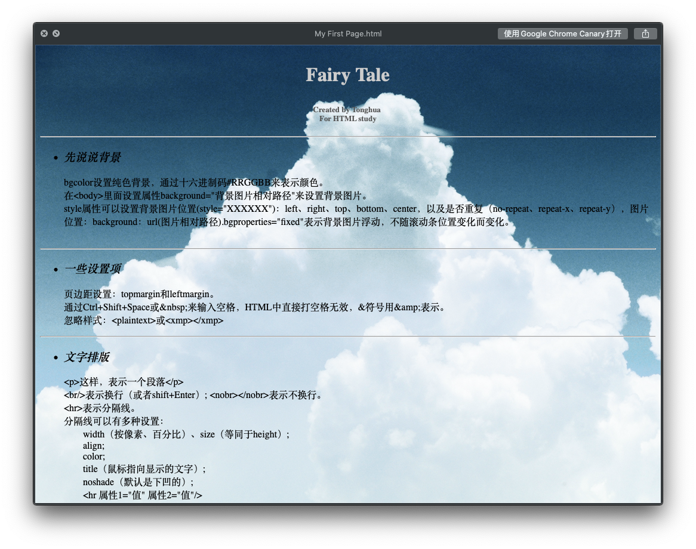

## 终于，我走了

2019 年，可能是我职业生涯中最大的转折点。6月底，我终于离开了供职 3 年多的前东家，进入了梦寐以求的阿里巴巴。

离开的主要原因，是前东家对未来发展的计划，已经无法再继续为我提供更多有价值的东西了，这其中名利当然是一部分，但更重要的是我的职业成长遇到了天花板。我想去见识更广阔的世界，我需要一个更大的平台。

6 月初，我做出了离职的决定，之后就开始接触猎头。到了月中，我手里已经有几个不错的 Offer，结合当时的市场环境我觉得差不多可以了，就正式跟老板提出了离职。老板很清楚留不住我，聊表心意之后也就没强留。6 月底最后一天班，转天 7 月马上入职新公司。

说来也巧，前脚我刚离开，后脚就从前同事那里听说了公司人员优化的消息。又过了几个月，从一些媒体得知，前东家彻底凉了。前东家成立于 2010 年，如果没凉的话，今年也十周年了。在平均寿命两年半的创业圈子里，能活十年也是不容易了，江湖祝好吧。

## 感谢曾经努力的自己

简单说一下面试的经过吧。

首先我给自己定了一个非常明确的方向：上海、互联网、大中型平台。由于没有换城市的打算，因此把范围限定在了上海，有些来自其他城市的橄榄枝虽然也很诱人，但我还是谢绝了。之前一直在小平台，虽然很自由，但小平台缺少规范的开发流程，我也很少有机会接触这方面的东西，所以希望借此机会能够进到一个大一点的平台，接触一些更加规范的工程化手段。

从第一场面试到决定收手，大概两周的时间。期间一共面了 5 家，谈成的有 2 家。为什么不多跑几家？第一，选择太多会让我很纠结，我崇尚够用就好；第二，能够满足我的求职需求，并且刚好有 HC 的公司本来也没那么多，而且谈成的里面已经有我心仪的选择，再找下去意义不大了。

技术面基本都在射程范围内，虽然有些问题我自知答得不太好，但最终都给过了。跟 HR 也都聊过了，如果愿意妥协的话，几家的 Offer 我都能拿，但有些点我实在不愿妥协的，也就主动提了不合适（比如加班很严重、跟面试官气场不和之类的）。

关于面试准备，其实没怎么特别准备，整理了一下各平台上的简历，粗略过了一些平时未必用到但面试经常会问的题，然后就上战场了。前东家虽然是个小平台，但给了我很大的自由度，可以自由选择技术栈，以及不怎么加班，因此在职期间我有大把的机会去实践自己感兴趣的技术；加上我在团队中担任的是前端的负责人，能够有机会站在管理者的视角去看到一个项目的整体设计，这一点在我的求职过程中起到了很大的作用。平时有所积累，关键时刻就不会慌，这一点，真的要感谢曾经努力的自己。

## 新起点

今年正好是阿里 20 周年，一入职就赶上马老师的谢幕演出。巧的是，早先我在虹软实习的时候，也赶上虹软的 20 周年，大概我命中注定跟这个数字有缘吧。

作为一家顶级公司，阿里巴巴的研发流程那是相当的规范，甚至有点复杂。从入职到现在，真心学到了很多东西，见识了很多过去听说过没见过的好东西，以及各种闻所未闻的骚操作。

目前所在的部门叫研发效能部，属于阿里云旗下，负责为整个产研群体提供基础工具层面的服务，具体业务是在研发一款名叫[「所思」](https://suosi.teambition.net)的知识库产品。

这款产品对设计和交互的要求非常高，核心是一个富文本编辑器，支持各种富媒体的编辑，底层还有着非常复杂的协同算法，是一个看上去小而美，实际上大而全，光 TS 代码就有几十万行的复杂系统。作为一个前端，能够有幸参与如此规模的项目，算是很值得了。

## 成长

野蛮生长，技术栈不虚，团队管理略懂

MobX、RxJS、Slate

对规范化的开发流程，CI、CD

流程规范

基础设施齐全

敏捷 Sprint、OKR

## 20 后

## Flag

### Flutter

### WebAssembly

### GraphQL

## 不忘初心

