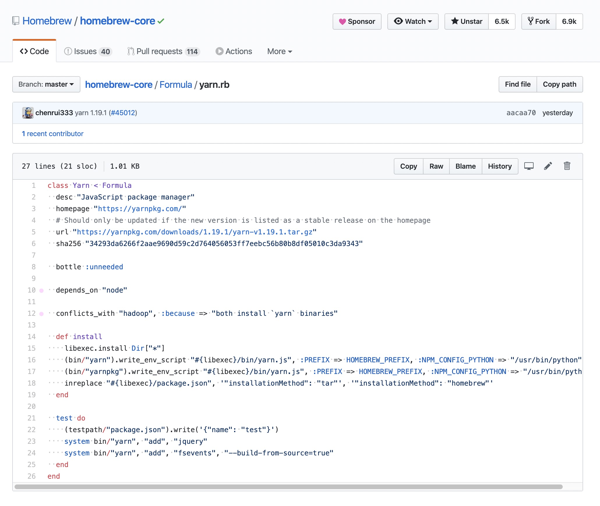
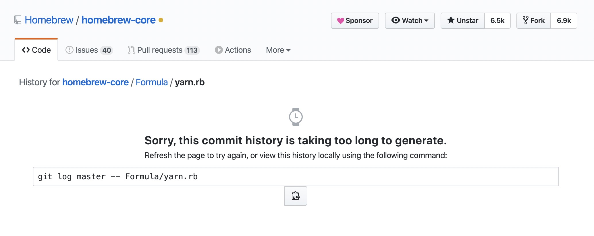
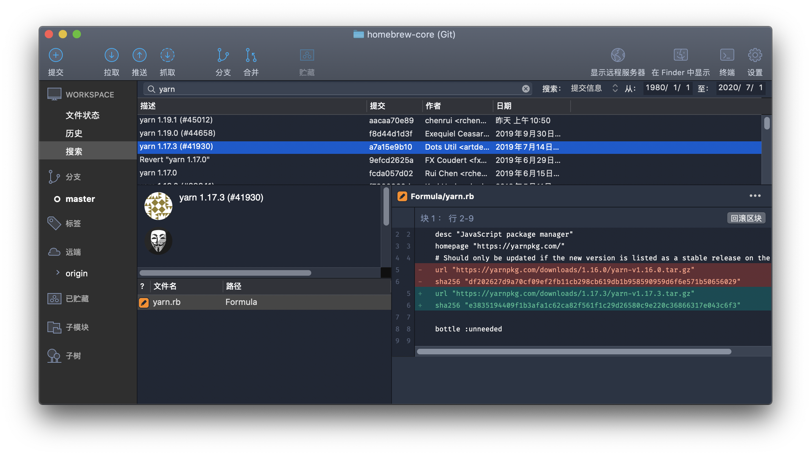

# 症状

原本只是一次例行的 Homebrew 更新，结果更新完 Yarn 挂了。查了下 Github，果然已经有人提了 [Issue](https://github.com/yarnpkg/yarn/issues/7584) 。

更新导致的问题，回退版本就是了。但坑的是，Homebrew 不像 npm 可以指定任意历史版本，大部分的 formula 仅提供最新版，并且 Homebrew 官方表示[这是有意为之](https://docs.brew.sh/Versions.html)。这给回退工作造成了巨大阻碍。

# 后悔药

Homebrew 中的每一个 Formula，都对应一个 Ruby 文件，其中记录了关于这个 Formula 的一些信息，包括下载地址。



Homebrew 官方提供的 Formula 是托管在 Github 上的，也就是说是可以看到提交记录的。默认情况下 Homebrew 会从 master 分支读取最新的版本，但 `brew install` 命令允许手动指定 Formula 的来源。因此只要我们能够找出某个 Formula 的历史版本，就可以手动安装它。

通常，我们可以直接在 Github 上点击「History」查看提交记录，但因为 [Homebrew/homebrew-core](https://github.com/Homebrew/homebrew-core) 这个仓库的历史提交太多了（每一个 Formula 的更新都算一次提交），系统已经算不过来了，建议大家把仓库克隆到本地之后，借助 SourceTree 等工具进行查看。



通过搜索关键字「Yarn」，我们很快就找出了 Yarn 的版本历史。



接下来，我们只要让 `brew install` 命令可以访问到这个文件就可以了。

`brew install` 命令支持从任意网络位置加载 Formula，所以我们只要把这个文件放到某个网络地址，然后把 URL 传给命令就可以了。事实上，Github 作为全球最大的代码托管平台，我们完全可以用它来获取 URL。

在 Github 中找到 `/Formula/yarn.rb` 这个文件，点击「Raw」查看原始文件，注意此时的 URL 中是带有分支名称的，默认是 master，像这样：

https://raw.githubusercontent.com/Homebrew/homebrew-core/master/Formula/yarn.rb

把它替换成某个 commit 的 id，就可以查看文件的历史版本了。注意，这里引入问题的版本是 1.19.0，我们需要回到它的上一个版本 1.17.3，因此我们要找的是 1.17.3 这个版本发布时的那个提交：

https://raw.githubusercontent.com/Homebrew/homebrew-core/a7a15e9b10f8652572db9c746a9fd01aa46a5de2/Formula/yarn.rb

然后把这一串 URL 作为参数贴到命令行中（为了更好的显示，这里只保留 URL 的头尾，你懂我意思就好）：

```bash
brew install https://raw.github......5de2/Formula/yarn.rb
```

剩下就只要等屏幕上的日志信息跑完，就大功告成了。（如果因为网络原因报错了，重试看看，或者换个网络再试下）

# PS

截至本文发布，Yarn 官方已经提供了 1.19.1 的 patch 更新，据称已经修复了这个问题。

经过这一次的踩坑，我也意外的发现，Homebrew 上记录的 Formula 的信息，和这个 Formula 自己的 GitHub 上的版本记录并非完全一致，比如 Yarn 在 1.17.3 和 1.19.0 之间其实还有个 1.18.0 的版本，在 Yarn 自己的 GitHub 的 Release 记录中可以查到，但在 Homebrew 的 Commit History 中就没有看到。

生命不息，踩坑不止。
