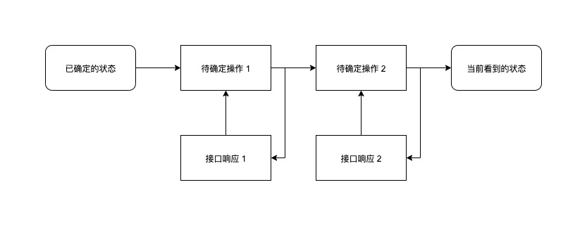

## 终于，我又营业了

2020 年的上半年，比往年任何时候过得都快。转眼已经到了下半年，终于，我又营业了。

在正式开始写这篇文章之前，我特意在百度、知乎、掘金等平台搜了一下「乐观更新」，发现相关的内容屈指可数，讲「乐观锁」的到是有不少。

那正好，就让我来填补一下这个空白吧。

## 什么是「乐观更新」

通常，客户端在发起 CRUD 请求之后，都需要等待服务端返回，然后再去更新视图。这逻辑非常合理，一点毛病没有。唯一的缺点，就是在等待服务端响应的时间里，客户端只能空等，直观感受就是：用户从交互结束，到看到结果，中间免不了会有一个可感知的延迟。稍微对用户体验有所追求的，都会在这个时候显示一个 Loading，让用户知道系统还在运行。

如果你体验过 Google 家的产品，你一定会惊叹于其交互的响应速度，那种按下按钮之后立刻得到结果的快感，就好像一切都发生在本地，根本不用等待接口响应一样。Google 之所以能做到这种程度，并不是因为它是 Google —— 一个掌握着浏览器、网络协议、V8 引擎等核心技术的互联网巨头。人家的方案非常简单：真就是不等待接口返回，请求发出去的同时，直接就把交互的结果体现到视图上。

这就是「乐观更新」：客户端假设请求必然成功，因此不等待接口的返回，先行对视图进行更新。

## 这么乐观，真的大丈夫吗？

乐观虽好，但我们也不能盲目乐观。并不是所有操作都可以通过「乐观更新」的方式来实现，需要有一些前提条件：

- 操作成功率非常高，大概率是不会失败的
- 接口正常响应的耗时很短
- 即便操作失败，或是误操作了，也可以轻易的撤销。

像发送一条消息、删除一个文件，这些都是可以考虑「乐观更新」的，能够大幅提升用户体验。

你能想象每发一条微信消息都会出现一个 Loading 的场景吗？Windows 10 已经默认把删除到回收站的确认框取消了你发现了吗？

反过来，像文件传输、鉴权相关的操作，就不适合「乐观更新」了。

你能想象迅雷还没开始下载就直接显示下载完毕了吗？或者用支付宝付款的时候，先显示支付成功，然后才告诉你余额不足吗？

## 要乐观，也要悲观

在一个良好的网络环境中（如 Wifi、4G），接口的返回大概率会是成功的。因此客户端在发起请求的同时，完全可以大胆假设接口的返回就是成功的。既然已经知道了结果，那就不用非得等接口了，直接就可以进行后面的操作。

然而这一系列的操作，全都是基于一个假设，既然是假设，那就必然有猜错的时候。为了确保系统逻辑的正确，我们必须要为这种情况做好准备。

因此，尽管「乐观更新」不等接口返回就已经开始后面的流程，但这并不表示我们对接口的返回就完全不关心了，还是需要等待接口的返回结果，来验证之前的操作是否真的有效。大概率下返回结果和预期是一致的，我们不用额外处理；但如果有偏差，就需要撤销之前的操作，并且告知用户。

## 自己搭一套乐观更新机制

### 架构

首先，我们来设计一下乐观更新的基本架构。



大体上和 Flux 的架构差不多，还是一个 reducer (state, action) => state 的过程，只不过中间的 action 是不确定的，不能即时消费掉，需要保存到一个队列中，直到状态被确认才能真正被消费掉。

乐观更新的 Action 和一般我们在 Redux 或者 Vuex 里见到的 Action 比较不同，由于不是即时消费掉的，它需要附带一些额外的信息来记录当前的状态，可能的结构如下：

```typescript
/**
 * @description 乐观更新的 Action
 */
export interface UpdateAction {
  /**
   * @description Action 的 ID（用于唯一标识一个 Action）
   */
  id: UpdateActionId,
  /**
   * @description Action 的类型（用于描述该 Action 做了什么）
   */
  type: UpdateActionType,
  /**
   * @description 操作产生的时间戳（毫秒）
   */
  createdAt?: number,
  /**
   * @description 操作更新的时间戳（毫秒）
   */
  updatedAt?: number,
  /**
   * @description 操作确认的时间戳（毫秒）
   */
  confirmedAt?: number,
  /**
   * @description 附带的数据
   */
  payload?: any
}
```

乐观更新的 Action 的生命周期有点类似 Promise，开始之后进入 pending 状态，之后要么被 confirm，要么被 cancel。最基本的例子就是在发送请求的同时，创建一个 Action 并将其添加到队列中，然后将队列中的 Action 依次应用到当前的 state 上得到新的 state。

比较特别的是，乐观更新的 Action 是可以被 update 的。因为一次乐观更新有时未必只包含一个对象的操作，有可能还包含一系列的关联数据。这就涉及到接下来要讲的「ID 管理」。

### ID 管理

在传统的 CRUD 结构中，通常都是由服务端负责生成数据的 ID，客户端只是读取。但在乐观更新中，客户端在接口返回之前就已经需要用到这些 ID，为此客户端必须要自己生成这些 ID。可如果直接把服务端生成 ID 的逻辑搬到客户端，在数据安全方面会有很大的隐患，因此客户端只能生成一个临时的 tempID，等拿到服务端生成的真正的 ID 之后再进行替换。对于只涉及单个个对象的场景，替换 ID 的操作安排在 confirm 时就好了。但如果创建一个对象的同时还需要创建若干个与之相关联的对象的话，问题就比较复杂了。

举个例子：创建父节点的同时，生成若干个子节点。


### 时序问题
