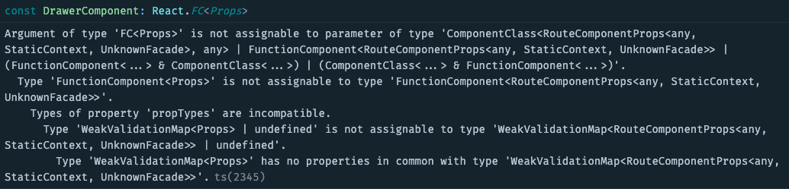

TypeScript 真的是个很神奇的东西，关于它我已经写过好几篇文章了。

我曾经分享过一些[上手指南](/blog/2019/07/28/typescript-the-second-day)，也探讨过它的[出生和死亡]('/blog/2019/10/10/typescript-another-fading-youth')。

这一篇，我们来谈谈由它引发的一些焦虑。

## 提笔忘字，是进步还是退步

自从用上 TypeScript 之后，就越发的离不开它了，突然要我用回 JavaScript，总有种隐隐的不安全感，就是那种你明明已经用过几百遍的函数，却依然不确定自己写的对不对。

每次开始用一个新的库，或是老的库更新了主版本，往往会遇到这样的问题：老代码这里不用指定泛型的，现在却需要了，但是要怎么写呢？

## 恐惧源于未知

我们之所以会觉得不安心，是因为我们不知道，或者不确定某个函数该怎么用，尤其是在第一次接触一个新的函数的时候

类型安全感

## any === nothing

未经定义的类型

## 感谢 VS Code

我已经很长时间没有用过 WebStorm 了，我不知道最新版本的 WebStorm 有没有类似的功能，但在 VS Code 中，普通的 JS 文件也会能受到 TS 的待遇，获得一些基本的类型推断。

## 对付恐惧最好的办法，就是直面恐惧

### 拥抱类型，尽早开始重构

### 完善类型，最自己好一点

很多时候，对于一些不确定的东西，出于懒惰，我们都会直接给一个 any，然后把这个坑留给下一个人。可往往，这个下一个人，就是你自己。

### 探索类型，让代码更健壮


### TypeScript & React

### TypeScript & React-Router

#### withRouter

按照 [官方提供的示例](https://reactrouter.com/web/api/withRouter)，`withRouter` 只要这样写就好了：

```ts
export default withRouter(Componet)
```

但如果你用的是 TypeScript，此时你很可能会遇到这样的错误：



原因在于 withRouter 向下传递了一些未定义的 Props，因此解决方法也很简单，给组件的 Props 上加上这些类型定义即可。`react-router` 已经提供了这部分的类型定义，直接继承即可：

```ts
import { RouteComponentProps, withRouter } from 'react-router-dom'

interface Props extends RouteComponentProps {}

export const DrawerComponent: FC<Props> = withRouter(props => {
  // ...
})

export const Drawer = withRouter(DrawerComponent)
```

### TypeScript & Axios

### TypeScript & RxJS

### TypeScript & Window


## 别怕，至少世界在进步


焦虑，为世界带来进步。

进步，为世界带来新的焦虑。


就像空调、网络已经成为人们生活的基础设置一样，「类型」也已经成了 JS 社区离不开的一部分。
