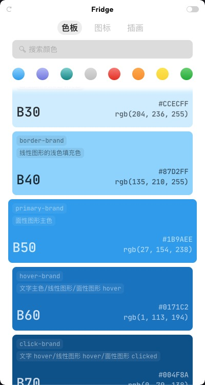
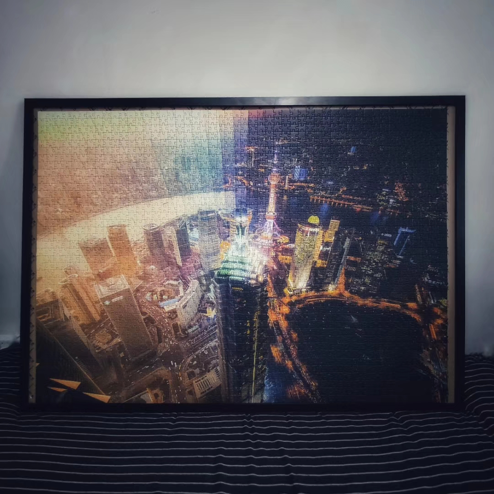
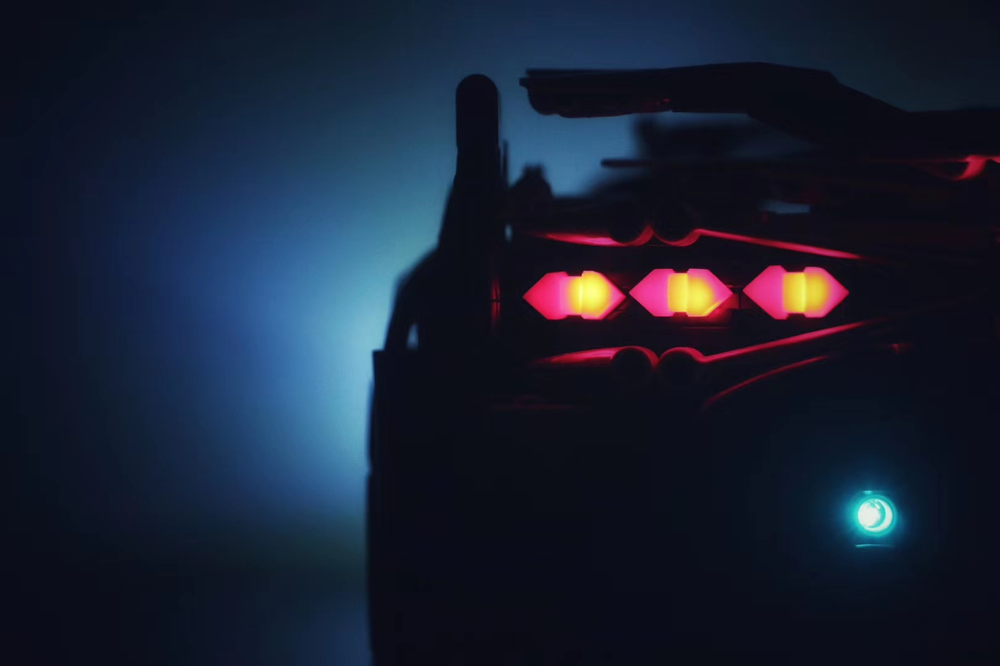
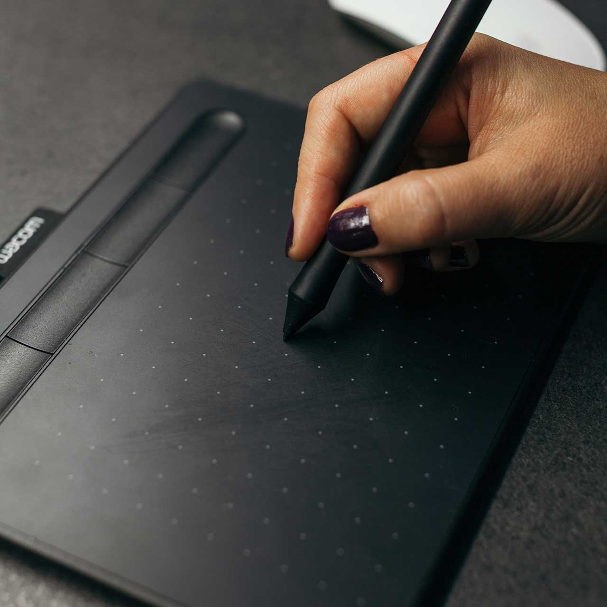
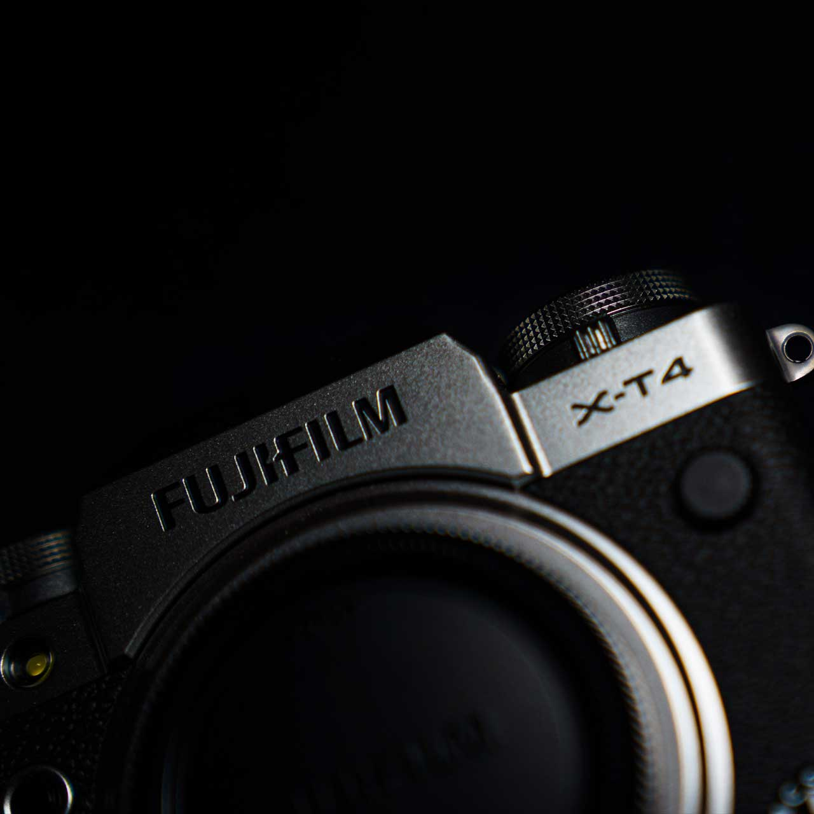

2020 年过的比往年都快。相比往年，今年我的博客产量真的可怜。一直到 7 月份才写了一篇，一直到了 12 月才想起来，真的好久没写点啥了。规划了好久的改版也迟迟没有动静。

输出减少，一方面是因为我懒，好些想要坚持的事情都没能坚持下来；另一方面，这一年，我大部分的精力都放在了输入上，包括知识、技能、视野，很好地达成了之前跳槽的目标：世界那么大，我想去看看。当然过程中也修了不少的福报，所以一闲下来就想当个废人，也因此就没怎么继续做内容的输出。

但每到年底，还是得回顾一下，这一年都干了点啥。

## BFF

今年算是正式在生产环境用 Node 写了一把 BFF。老实说，这种伪全栈的感觉还是挺爽的。

当然，前端和后端在设计思维上还是有比较大的不同的，比如后端对数据安全要求特别高，会需要各种 Guard 来进行鉴权操作，以确保每一步操作都合理合法；后端会涉及到 DI、AOP、中间件等大部分前端开发者很少会接触到的编程方法；后端会需要处理大流量高并发的场景，需要特别关注接口的响应时间，还要做接口限流；由于不能像前端那么方便的在浏览器里直接调试，后端还需要借助单独的日志系统，并规范日志格式；后端还需要应对各种内容审核、风控、灰产等问题。这些都是我在做纯前端的时候，不需要考虑，或者完全没想过的问题。

由于之前在这方面的积累比较少，初上手开发的时候也是摸石头过河，很多时候都是现学现卖，过程中也没少被人提意见，还好领导比较 Nice，给了不少指导，让我学到了不少。

## 小程序

今年也接触了一些小程序相关的东西，微信和钉钉的都有。这算是第一次正经涉足多端领域，试图通过一套代码适配多端，中间遇到的坑比预想的要多得多。

最大的限制就是小程序的包体积限制，导致很多在 Web 端完全可以忽略的问题，在小程序这里显得尤为明显。为此我们清理了一遍三方依赖，减少一切非必要的外部资源，并且做了大量的代码重构，以尽可能减少打包时引入的代码量；还把图片等静态资源通通丢给 CDN，尽一切可能降低打包尺寸。

小程序虽然是基于 Web 的技术开发，甚至可以借助一些轮子从纯 Web 项目转换生成，但小程序的路由设计并不完全和 Web 端一样，这在初上手的时候是个必踩的坑。

小程序对安全性要求也特别高，动不动就是各种域名白名单，初上手不了解情况，没少在这个问题上踩坑。明明本地好的，到手机上就打不开；开着调试工具能行，关上立马就废；好生折腾。

小程序的开发工具也是很多人吐槽的点，虽然可以转战 VSCode，但一些语法特定的功能还没有很好的扩展支持，最后往往还是开了两个编辑器。

## mono-repo

这是最近在做的事情，因为经常涉及到多端的场景，所以想把项目改造成 monorepo 的形式，以方便复用和管理。

mono-repo 的搭建并不复杂，有 lerna 这样成熟的工具，很容易就可以搭起架子来。但由于不是开源的项目，不能直接发布到 npm，项目如何分包部署的问题就变得比较复杂了，尤其在现有的基建没有专门针对 mono-repo 作为优化的前提下。另外还有版本管理、构建规范、依赖优化等等问题需要解决。等这一版做完，准备写一篇文章单独来讲一讲其中的思考。

## 小工具

除了业务上的产出，今年我也为团队贡献了两个提效的小工具。（都是内部工具，不用去百度上搜了，能搜到那就见鬼了）

一个叫 Fridge，是一款基于 Electron 开发的设计资产速查工具，和团队内一位负责设计系统的体验设计师一起合作的项目。

Fridge 的价值在于能够方便的对设计资产进行一个展示和检索，方便设计师与工程师之间对设计资产的沟通。设计师只需要按照约定的方式把颜色、图标、插画等设计资产同步到云端，其他人就能在 Fridge 中看到最新的成果，并能够通过搜索框快速查找到想要的资源信息。

举两个具体场景来说明一下 Fridge 的价值：

场景 1：工程师看到设计稿上某个元素的颜色为 #1B9AEE，但在代码中我们不能直接这么用，需要通过事先定义好的变量来引用这个颜色，但光凭这个十六进制的值，很难联想到它对应的变量名叫什么。这时候只需要把这个值复制到 Fridge 中一搜，就能立刻知道：这是个什么颜色、它的变量名是什么、相关的 RGBA、HEX 取值是什么，并且所有这些内容都可以一键复制，立即使用。

场景 2：工程师需要在代码里引用一个 iconfont 图标，尽管设计师已经给图标命了名，但从 Figma 上并不能知道它叫什么。这时候，就可以直接从 Figma 中复制这个 iconfont 图标对应的文本，到 Fridge 里一搜，就能立刻找到这个图标，并且知道它的名称、unicode，还能一键复制想要的格式到 Figma 或 VS Code 中使用。

另一个叫 WormHole，是一款 Cookie 切换工具，以 Chrome Extension 的形式存在。最近正在考虑给它换个名字，我也是后来才得知，集团已经有一个叫 WormHole 的东西了，是一个用 Node 写的服务端渲染模版的容器。

如果只是单纯的 Cookie 读写功能，那么 Chrome 应用商店里已经有不少现成的选择，我们也可以通过浏览器的 Dev Tool 来进行编辑。但实际的场景是，我们需要借助 Cookie 在多个约定好的环境中进行切换，需要有一组开关，能够一键在多个选项中直接进行选择，把我们带到想要的环境中去。而 WormHole 就是为了解决这个问题而生的。

WormHole 本身并不复杂，只是在 Cookie 读写功能的基础上，允许用户将 Cookie 的取值保存下来，保存之后，只需一键就能在多个预设之间来回切换。很简单的功能增强，却显著地提高了工具的实用性。

## Life is Good

互联网行业算是复工最早的一批，3 月初我就回到了公司，但因为出门就得戴口罩，口罩戴久了又很难受，所以上半年除了通勤我基本没出门。为了让宅在家里的周末有点事情干，我开始发展一些兴趣爱好。

先是买了一张 2000 pics 的拼图，一点点一点点，拼了一个月，终于完成了。

然后又开始买乐高，看中了今年新出的 Lamborghini Sian，碍于价格选择了国产的高仿，说实话质量真的没差，品牌溢价太高了。

一个没过瘾，之后又零零碎碎买了各种小的乐高的，以及一些拼装手工，算是彻底过瘾了。

下半年因为一些公众号的安利，对原画产生了兴趣，几经犹豫，还是买了一块 Wacom 的入门款鼠绘板。调试了半天终于连上了，挺奇妙的感觉，跟 Apple Pencil 还不太一样，需要花点时间适应一下。

觊觎富士的胶片模拟很久了，终于，双十一的时候分期了一台 XT4，还非常俗气地配了一个 JJC 的红点快门。拿到东西确实很喜欢，复古造型加上标志性的直出色彩，爱了爱了。

这一年在兴趣爱好上花了不少钱，买了好些大件。当然我也不是只知道大手大脚的花钱的主，后疫情时代，整个股市总体表现一直很强劲，我也成功搭上这班车，小赚了一笔。总的算下来，这部分的收益完全可以 Cover 住我在兴趣方面的花销。

## Flags for 2021

### 多端

按照我的理解，「多端」一定会是明年的一个重头戏，除了已经在做的 mono-repo，Flutter 和 Electron 也依然需要继续研究。至少 Fridge 2.0 已经在路上了。

### 数据库

长期不接触后端和数据库，感觉自己计科的底子都有点弱了，跟后端大佬们讨论问题的时候，一旦话题开始转向 MongoDB、Redis，我就自觉闭麦了。这样不好，不好。

### DDD

公司的几个 P7 在讨论架构时候几乎是言必谈「领域驱动设计」，于是默默买了本《领域驱动设计：软件核心复杂性应对之道》，准备提升一下自己的视野。

### 健身

上一次发福是在大学的时候，4 年胖到 200 多斤，为了找工作减到了 140。掐指一算又 4 年多过去了，是时候再重置一次了。希望自己 30 岁的生日礼物，是一个不惧镜头的身体。

### 坚持写作

一直觉得写作是一项很好的习惯，可以很好的给自己做一个阶段性的复盘。当然，重点还是要把这个博客给更起来，持续进行一些产出。没有可输出的东西，其实也是缺少思考的表现，在这一行，停止思考还是挺危险的。

### 手绘

这算是今年新发展出来的兴趣吧，对原画开始感兴趣，想能画点像样的东西出来。对设计感兴趣，但手绘和色彩一直是阻碍我通往专业道路的两道坎，一个个来，看能不能达成一些进步。

### 剪片子

大学的时候，因为学生会活动的需要，自学了一点非编的东西。好久不碰了，偶然想起自己还有这么一项早已忘却了的技能呢。正好这又是个视频的时代，就干脆重新学一下吧。

首要目标是 Final Cut Pro，毕竟用惯了 Mac，外加专业影视制作也大多用这个；Premiere 和 After Effect 曾经学过一点，但那会儿还是 CS6，和现在差好多，得补补课了。

Cinema 4D 也成功的引起了我的注意，主要是现在新拟物的盛行，想看看能不能自己做点东西出来。

Davinci Resolve 暂时先不作为目标吧，主要是对颜色不是那么敏感，外加也没那么专业的硬件。

### 乌克丽丽

早年间买的一把乌克丽丽，三分钟热度过后就去吃灰了。是时候拿出来，擦擦灰了，嗯。

## Goodby, Hello

Goodby 2020，你马上就要下班了。惨淡过，但终将雄起。

Hello 2021，请赐予我重生的力量。
