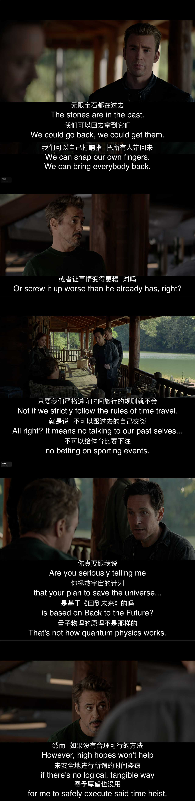

Hi，是我，著名拖更博主，终于又出现了。这一次我们来聊点不一样的，聊点技术以外的话题。

公司最近组织了一个内部的「吐槽大会」，所有员工都可以报名参加，公开倒苦水，把心里积蓄已久的怨念大声地怼到对方脸上。不出意外的，产品和开发之间的日常互怼再一次成为了热门话题。

## 关于产品

### 产品啥都不懂？还啥都想要？

大部分针对产品的花式吐槽，都来自开发，认为产品是不懂技术的傻白甜，经常提一些非常理想化的需求，却不关心怎么实现。

开发对产品的「敌意」并非与生俱来，只是因为在过往的经历中接触了太多不专业的产品，自然而然地形成了一种防御机制。相比开发，产品对公司业务拥有更多的决策权，决策的内容除了会影响业务的成败，也会直接影响开发的工作量，一旦出现一些无脑决策，开发的日子就会很不好过。并且产品的决策失误，最终往往会由开发来埋单，因此开发对这种事就非常反感。再加上很多产品并非技术出身，就很容易形成观点认为是产品不懂技术导致的。

关于产品需不需要懂技术这个问题，业界已经有非常多的讨论，这里就不展开了，一句话：非必要，但能懂更好。这里所说的「技术」，并不是指具体的编程能力，而是指软件工程的一些基本概念，了解这些概念有助于产出更加完善的产品设计方案，也有助于了解开发到底在想什么，产生共情，以便更好地沟通。

当然，产品也有自己的难处，首先方向性的决策本身就很难做，需要考虑的事情很多，很难一次就想清楚全部细节；而且产品的研发过程涉及到很多跨部门的合作，很多事情并不完全在产品的掌控之中；再者实施过程难免会产生一些意外的变数，很多风险是无法完全预知的，很难保证最初的方案在落实过程中不变卦。因此「需求变更」这事儿，有时候产品也很无奈。

### 产品经理 vs. 项目经理

和「产品经理」经常一起出现的，还有一个叫「项目经理」的职位，看上去两者非常相似，都可以是某个产品线的负责人，但实际上两者的职能完全不同。产品经理更加侧重产品设计、用户体验、以及商业化方面的东西，是一个偏设计向的工作；而项目经理则比较偏管理向，更加关注进度、风险、实施这些与软件交付更加相关的事宜。

在一些流程规范的大公司里，项目经理是一个团队的标配，也是一个项目真正的负责人，在这样的团队中，产品经理就能够回归项目成员的身份，专心自己专业上的事。但在一些规模不是很大的公司中，可能并没有专职的项目经理，产品经理同时也承担了项目经理的角色。

由于项目管理本身也是一项非常复杂非常专业的工作，并不是每个产品都擅长这件事，因此很多人其实是对项目经理的不满，产品只是代为受过。

## 关于开发

### 开发啥都做不了？还假装啥都懂？

巧的是，绝大部分针对开发的花式吐槽，都来自产品，认为开发是情商为负的小屁孩，看上去懂得很多，一提需求就各种做不了，还总喜欢甩锅。

产品对开发倒是没有什么「敌意」，更多的是一种「嫌弃」，觉得开发不配合自己的工作，总是想方设法地拒绝需求，在进度把控方面也不太主动。

从事软件开发工作的人大多是理工科出身，普遍智商不低、情商不高。由于人数比例上的绝对优势，开发通常是团队中的主力军，团队的整体氛围也是偏技术向的，很容易让开发高估了非技术岗位对技术的认知程度，想当然觉得团队里的人都应该懂技术。但由于软件开发工作的专业性，很少能听到产品对开发的专业度表示质疑；但反过来，产品的工作和设计一样，给人一种好像谁都能掺一脚的错觉，因此往往是开发在吐槽产品的设计有问题。

和产品工作的引导性不同，开发的工作是把想法落地，因此求稳比求新求快更加重要。开发不是魔术师，既不万能，也不全能，不是什么样的需求都能够奇迹般的实现。就像医生，不是什么病都能治，也不是所有能治的病都能给同一个医生治。

开发对需求的抗拒，其实本质上是对加班的抗拒，尤其是一些不合时宜的紧急任务，往往会打乱原本的计划，并产生额外的工作量。

### 技术专家

每个开发团队都会有一些比较资深的骨干成员，在一些大公司这些人会被赋予「技术专家」的称号，以凸显其在某个领域的深度。技术专家除了自己本专业的工作内容外，其实也负责团队与其它部门的工作对接，过程中就会涉及到向一些非技术的同学解释技术问题。

## 甲方乙方

产品负责提出需求，开发负责实现需求，像这样的关系并非互联网行业专属，还有很多：患者和医生、业主和装修队、顾客和外卖员、。。。

这不就是典型的甲方和乙方的关系么。甲方之所以会需要乙方，就是因为乙方是专业的，甲方不懂的问题乙方懂，甲方不知道该怎么办的乙方知道，如果甲方自己就能办的事儿，还需要乙方干啥。

## 自古红蓝出 CP

## 化敌为友

### 保持敬畏，不懂就问

我们都讨厌不懂装懂的人，尤其当这些人的决定对我们会造成负面影响的时候。而对于那些虚心好问的人，除非问的问题实在太低级，或者自己实在太忙没时间，我们通常都是很愿意互相分享一些知识的。

### 一定要做需求评审

需求评审是避免无脑决策的有效方式之一，这个阶段会让需求相关的所有人都参与进来，产品、设计、开发、测试、……必要的话可能还有运营等一些其它职能的人

需求评审时，产品会结合需求文档，向开发阐述需求的具体内容。要需求文档是对产品思考过程的体现，

当然，需求评审并不能完全避免意外，但可以很大程度地提高方案的可行性，降低意外发生的概率。

### 工作量证明

开发的工作产出可以很直观的通过软件交付和加班被产品看到，但反过来产品的工作产出却很少被开发看到，因此很多时候开发会觉得产品很闲，一天到晚不知道在干啥。
