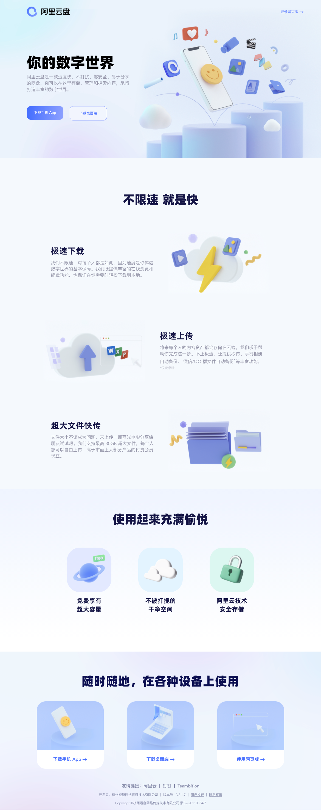
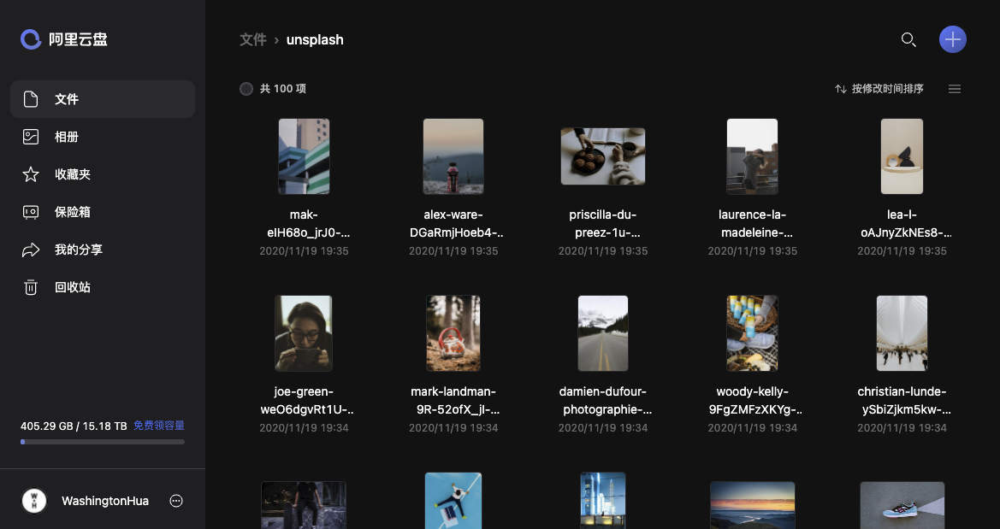
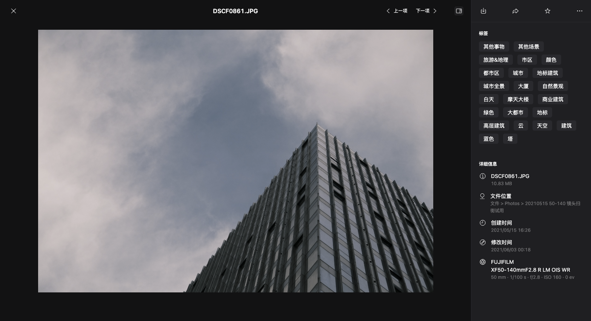

# 阿里云盘

## 简介

阿里云盘（aDrive）是阿里云出品的一款网盘服务，由 Teambition 网盘原班人马打造，早期以不限速为主要卖点，直击此前网盘市场饱受诟病的限速问题。征途是想成为一个数字世界的平台。

这个项目也是我从头开始参与的一个项目，除了传统的 Web 端，这次还涉及到基于 Electron 的桌面端开发，又是一个新的领域。虽然之前做过 Fridge，算是对 Electron 有一些了解，但是真正应用到商业项目中还是第一次，因此当领导把桌面端交给我负责时，我还是有那么点慌，赶紧现学了好多东西。

这个项目也是首次尝试使用 Monorepo 的方式去管理代码仓库，早在项目还没开始 MVP 阶段的时候，我就开始负责 Monorepo 的搭建，那会儿还不知道有 Nx 这样的工具，就只知道用最原始的方式基于 Lerna 去做，参考了 React、Babel 等比较大的项目依葫芦画瓢的搭了起来。当时市面上教 Lerna 怎么用的文章有很多，但是基于 Monorepo 的最佳实践和代码管理却很少有相关资料，基本都是一只脚已经进到坑里了，才在 stackoverflow 上找到零星的回答。例如 package 的创建有没有比较好的脚手架设计、各 package 的公共依赖到底如何规划比较合适、依赖版本管理怎么进行、发布的版本管理怎么做，很多问题都没有现成的答案，即便是阿里内部的基建也都还没有对 Monorepo 提供比较好的支持。但是反过来，或许这里恰好是一个比较好的切入点，可以做点什么。

## 周期

2020 年 12 月 - 至今

## 相关链接

[线上地址](https://www.aliyundrive.com/)

## 项目截图

