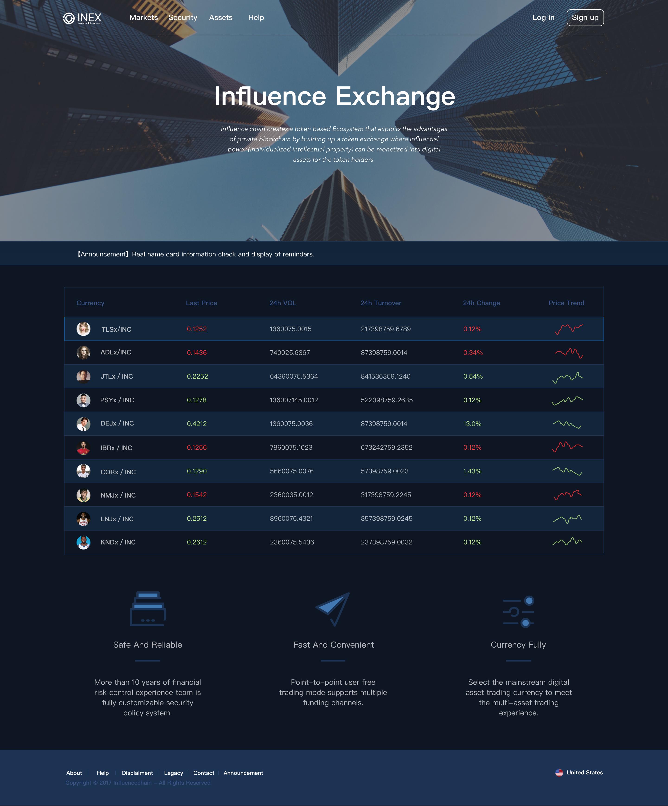
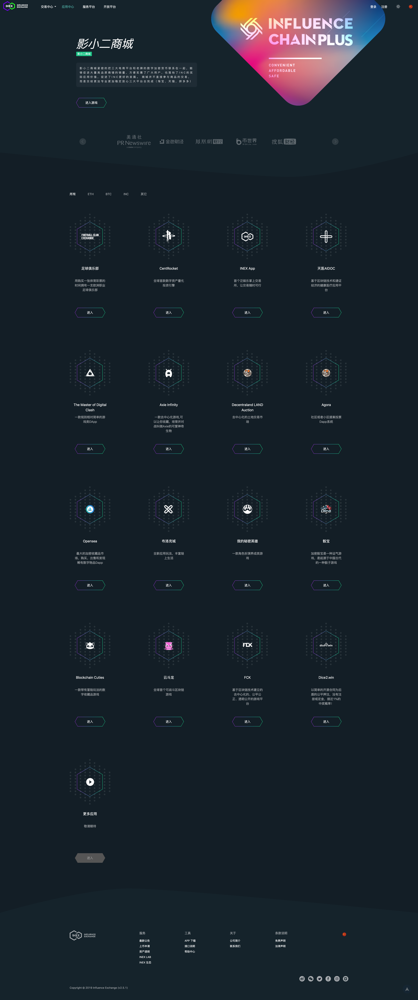

# 影力所

## 简介

影力所（INEX，Influence Exchange）是一款泛娱乐领域的垂直数字资产交易所，用户可借助该平台进行数字货币的交易。

项目基于 React 16 开发，并已全面迁移至新版生命周期、Ref API，并应用了 ErrorBoundary、Fragment、memo 等新特性，后期新组件改用 Hooks + TypeScript 实现。项目整体使用 ES Next + SCSS 进行开发，使用 TradingView 绘制了 K 线图，使用 ECharts 绘制了深度图、影响力指数雷达图等，通过 WebSocket 实现交易数据的实时更新，并通过 WebWorker 进行性能优化。项目严格遵循 Standard 风格的代码规范，使用 ESLint 和 Stylelint 约束团队编码风格，使用 Jest 进行单元测试，Git 的使用严格遵循 Git Workflow 以及 Conventional 规范。

## 周期

2018 年 1 月 - 2019 年 6 月

## 相关链接

[线上地址](https://www.inex.exchange)

## 项目截图

