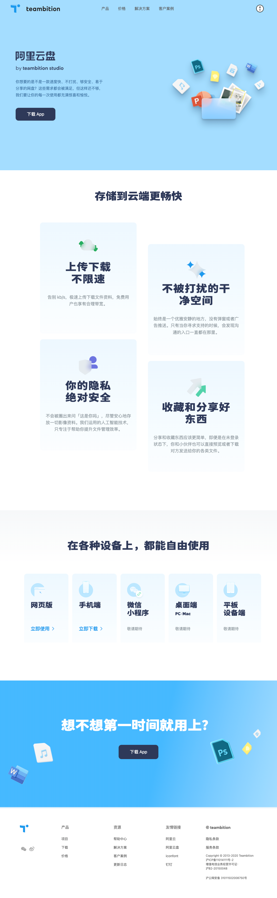
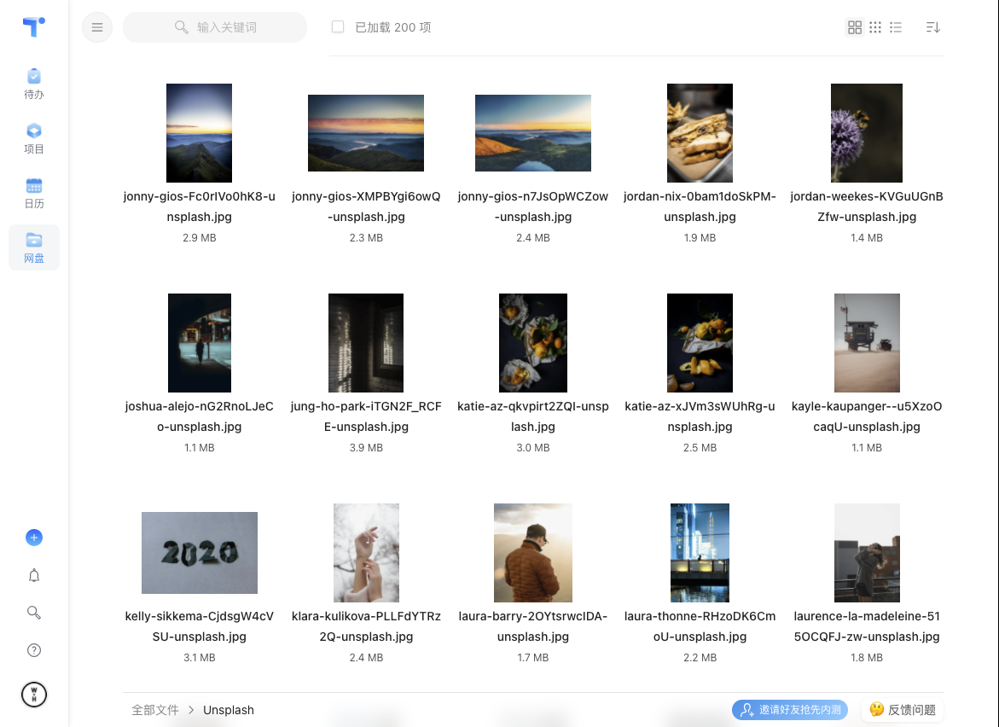

# Teambition 网盘

## 简介

Teambition 网盘，是 Teambition 出品的一款网盘应用，曾经是 Teambition 办公套件的一部分。后因战略原因停止运营，原班人马全部投入「阿里云盘」项目。

该项目由我作为前端的 App Owner，负责 Web 和 BFF 层的开发。结合团队现有的技术栈，我们选择了 Nest 作为 Node 框架。这是我第一次在商业项目中实践 Server 端的 Node 开发，由于对后端实践的匮乏，过程中犯过很多错，例如缺少日志、接口没有做限流、很多地方权限校验被安全团队抓到漏洞，复杂查询的性能优化做的不够，感谢后端兄弟们的指正和帮忙，才让我在重要节点上没有翻车。

前端方面，由于之前有过相关业务的经验，并且这次的项目很大程度上也把我曾经参与的项目作为了重要竞品进行调研，因此在业务实现方面都还比较顺手，除了 Teambition 祖传的高难度交互外，并没有什么特别大的挑战。

[曾经在知乎上回答过一个问题](https://www.zhihu.com/question/405803611/answer/1332256869)，其中描述的就是项目中评论列表的实现，可能比一般见到的要复杂那么亿点点🤏🏻。。

另外在该项目期间，Teambition 整体也在进行架构调整，引入了微前端的实践，虽然微前端基座的实现并不是由我所在的团队负责，我们只是进行接入，但在过程中和相关负责同学的交流也让我对微前端的价值和原理有了直观的认识，例如公共依赖的重复与冲突、多应用间的样式污染问题、以及应用入口相关的一些坑。

## 周期

2020 年 4 月 - 2021 年 9 月

该项目我全程参与，起止时间既是我参与该项目的时间，也是该项目本身的起止时间。

## 相关链接

[线上地址](https://www.teambition.com/pan/)

## 项目截图

