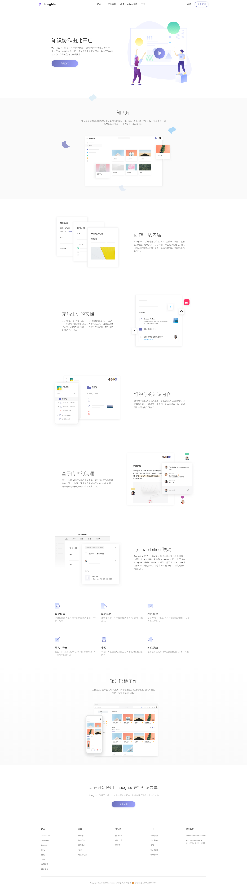

# Thoughts 所思

## 简介

Thoughts 是一款企业知识管理应用，成员在这里沉淀和共享知识。通过可协作的结构化的文档，将知识积累和沉淀下来，并在团队中有效流动，企业的创造力由此提升。

项目基于 React + TypeScript 进行开发，Node 作为 BFF。核心编辑器基于 Slate 开发，很多段落式富文本编辑器的开发都是基于这个框架进行的。该项目最大的两个难点，在于「富文本编辑」和「协同冲突检测与处理」，前者难点在于富文本场景的复杂性，具体可以参考 [知乎上关于这个问题的讨论](https://www.zhihu.com/question/38699645)，基本上都讲到了；后者则涉及到 [OT](https://en.wikipedia.org/wiki/Operational_transformation) 和 [CRDT](https://en.wikipedia.org/wiki/Conflict-free_replicated_data_type) 算法，是个值得深究的领域。

其中我参与了协同算法的部分实现，并负责了 Roadmap、Image 等组件的开发、全站多主题、多语言的实现，以及 Stylus 迁移至 Sass、CSS Modules 化、ts-loader 迁移至 Babel 等工程化基建的改造。

## 周期

2019 年 7 月 - 2020 年 6 月

起止时间均为我参与该项目的时间，并非该项目本身的起止时间。

## 相关链接

[线上地址](https://suosi.teambition.net)

## 项目截图

