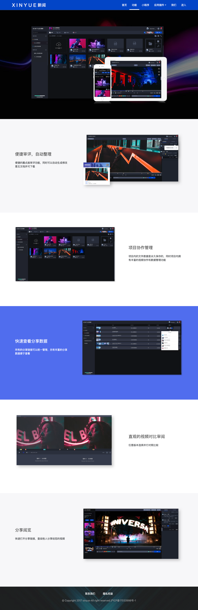

# 阅流

## 简介

阅流（原名：新阅），一款音视频资产管理与协同工作流平台，中国版的 [frame.io](https://www.frame.io/)。主要功能包括：文件云存储、在线预览、分享、评论、标注、版本控制等。

项目使用 React 全家桶进行开发。借助 Canvas，实现了基于视频关键帧的手绘标注功能，通过创建多个离屏 Canvas 进行绘图，确保各组件的性能得到保障；通过记录绘制历史，支持了撤销/重绘等操作。我们还自定义了一款视频播放器，以满足项目中的一些自定义功能，除了常规的播放控制，还支持显示出血线、切换画面比例、切换清晰度、悬浮进度条显示视频预览、多类型时间戳等增强功能。为实现文件管理，我们在前端实现了一整套的文件系统，包括完整的目录结构树、自定义右键菜单、拖拽移动文件、框选多个文件、键鼠配合的快捷操作等，支持鼠标划过文件封面时快速预览视频，仿 macOS 的空格键预览功能等。

项目严格按照 React 官方文档推荐的方式进行组件化开发，使用 PropTypes 配合 Flow 进行类型检查。使用 standard.js 来统一开发组成员之间的代码风格。使用高阶组件来优化结构，借助 shouldComponentUpdate 函数精简不必要的渲染。样式方面以 SCSS 为主，配合 PostCSS 补齐兼容代码，部分公共组件，如 Tooltip、Dropdown、Toast 等尝试性地使用了 CSS Modules 技术。

项目充分利用 ES2015+ 语法的新特性，自行封装了基于 fetch 的 HTTP 客户端。使用 Yarn 进行依赖管理，Webpack 进行构建，Git 进行版本控制。

## 周期

2017 年 8 月 - 2017 年 10 月

## 相关链接

[线上地址](https://www.yueliu.cn/)

## 项目截图

